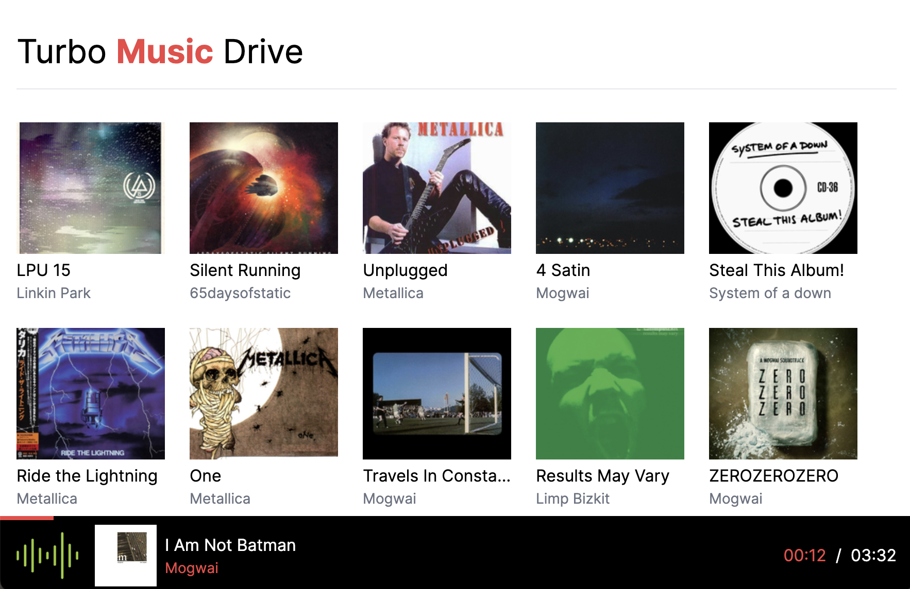
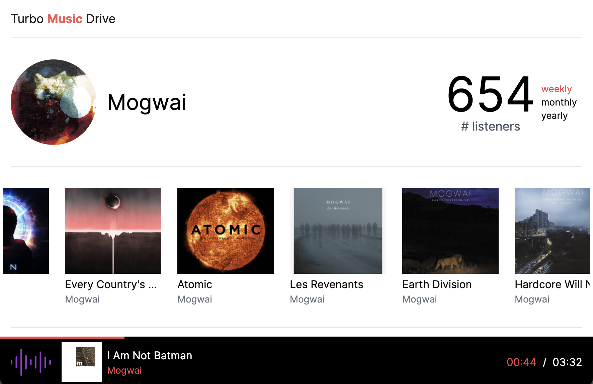

# Turbo Music Drive

This is a demo application exploring [Turbo][] features and extensions. **See it [live](https://turbo-music-drive.fly.dev)!**

|                        |                        |
| ---------------------- | ---------------------- |
|  |  |

Here is the list of features and the corresponding PRs (so you can see how it was implemented):

- [Morphing](https://github.com/palkan/turbo-music-drive/pull/1)
- [View transitions](https://github.com/palkan/turbo-music-drive/pull/2)

>   Read more in Evil Martians' [The Future of Full-Stack Rails][the-post-1] blog series.

## Running locally

All you need is Ruby 3.3+.

Install dependencies:

```sh
bundle install
```

Run a web server along with the TailwindCSS CLI to build (and re-build) styles:

```sh
bin/dev
```

Go to [localhost:3000](http://localhost:3000) and enjoy!

[Turbo]: https://turbo.hotwired.dev
[the-post-1]: https://evilmartians.com/chronicles/the-future-of-full-stack-rails-turbo-morph-drive
